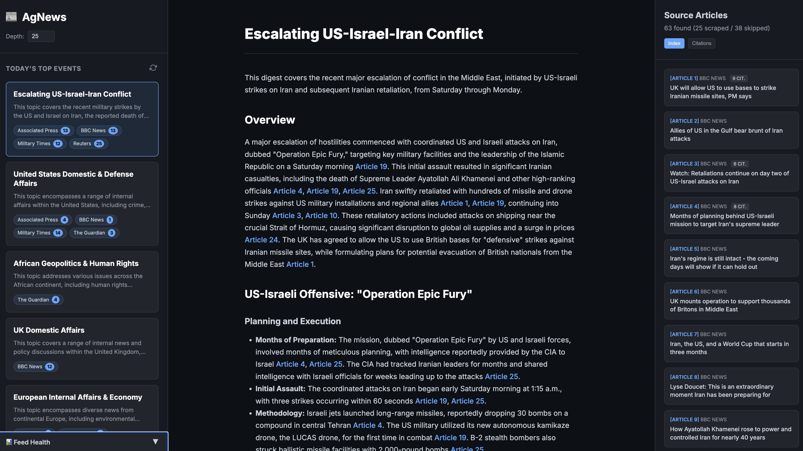

# AgNews Scraper

A powerful Go-based news aggregator and digester that uses Gemini AI to cluster recent news topics and generate concise, fact-based summaries.



## Features

- **Concurrent Feed Ingestion**: Scrapes RSS/Atom feeds from major news sources (Reuters, AP, BBC, etc.) simultaneously.
- **AI Topic Clustering**: Uses Gemini 2.5 Flash to intelligently group related headlines into thematic "Events".
- **Intelligent Summarization**: Automatically extracts full text from articles (bypassing many paywalls) and compresses them into factual digests.
- **Multi-Layer Caching**: Persistent local caching for clusters, individual article facts, and final digests to minimize API costs and latency.
- **Feed Health Dashboard**: Real-time metrics on source availability, new vs. cached articles, and scrape success rates.
- **Interactive UI**: Modern, dark-mode interface with scrollable source panels, citation counting, and flexible sorting.

## Getting Started

1.  **Set up environment**:
    Create a `.env` file with your Gemini API key:
    ```bash
    GEMINI_API_KEY=your_key_here
    ```

2.  **Build and Run**:
    ```bash
    go build
    ./ag_news
    ```

3.  **Access**:
    Open [http://localhost:8080](http://localhost:8080) in your browser.

## Tech Stack

- **Backend**: Go (standard library + `gofeed`, `goquery`, `genai-go`)
- **Frontend**: Vanilla JS, CSS (Glassmorphism), HTML5
- **AI**: Google Gemini API (2.5 Flash)
